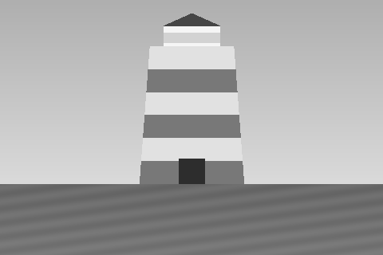

# Ankunft {#ankunft}

Das Boot legt ab, sobald du den Fuß auf die Treppe setzt. Der Steuermann winkt
nicht.

{sturm: Die See geht hoch und schlägt gegen die Bank.|Die See liegt flach vor dir, und das ist selten genug.}

* [Hinauf in die Laterne](#laterne)
  ~ zeit += 5
* {wasser < 8} [Erst in den Keller sehen](#keller)
  ~ zeit += 5
* {wasser >= 8} [Die Kellertreppe steht unter Wasser](#abgeschnitten)
  ~ zeit += 5
+ {wasser > 0} [Nachsehen, wie hoch das Wasser steht](#pumpe)

# Die Laterne {#laterne}

Der Docht ist heruntergebrannt, das Glas beschlagen. Von hier oben siehst du
die Sandbank ganz: eine Handbreit Land, und ringsum Wasser.

{sturm: Der Turm steht in der Brandung wie ein Daumen im Wind.}
{ruhig: Draußen liegt alles so still, dass du deine eigenen Schritte hörst.}

* {oel > 0} [Die Lampe anzünden](#brennt)
  ~ zeit += 10
* {oel <= 0} [Es ist kein Öl mehr da](#dunkel)
  ~ zeit += 10
* {oel < 4 and wasser < 8} [Öl holen, solange noch welches da ist](#keller)
  ~ zeit += 10
+ [Hinunter](#ankunft)
  ~ zeit += 5

# Das Licht brennt {#brennt}

Der Docht fängt, das Glas klart auf, und der Strahl fährt über das Wasser wie
ein Arm, der etwas sucht.

{sturm: Irgendwo da draußen dreht ein Schiff bei. Ob deinetwegen, wirst du nie
erfahren.|Kein Schiff weit und breit. Das Licht brennt trotzdem, dafür steht
es hier.}

-> zurueck

# Der Keller {#keller}

Zwei Fässer Öl, eine Pumpe, und Wasser, das sich zwischen den Steinen Zeit
lässt.

{wasser >= 6: Es steht dir bis über die Knöchel.|Ein Film, mehr nicht.}

* [Öl holen](#oel-geholt)
  ~ zeit += 10
  ~ oel = 8
* {wasser > 0} [Pumpen](#pumpe)
  ~ zeit += 15
+ [Zurück ans Licht](#laterne)
  ~ zeit += 5

# Das Öl ist oben {#oel-geholt}

Ein volles Fass die Treppe hinauf, und deine Arme sagen dir hinterher, was sie
davon halten.

-> laterne

# Die Pumpe {#pumpe}

Sie ist alt und sie weiß es. Zwanzig Züge, und der Keller gibt eine Handbreit
zurück.

~ wasser = max(wasser - 4, 0)

{wasser == 0: Trocken. Für heute.|Es steht noch immer da, aber es steht
niedriger.}

+ [Weiter](#laterne)
  ~ zeit += 5

# Abgeschnitten {#abgeschnitten}

Die letzten drei Stufen stehen im Wasser, und was auf ihnen läge, läge darin.
Die Fässer sind da unten. Sie bleiben da unten.

+ [Hinauf](#laterne)
  ~ zeit += 5

# Es bleibt dunkel {#dunkel}

Der Docht saugt an nichts. Du drehst ihn hoch, und er bleibt kalt.

{sturm: Die Nacht wird lang, und du wirst sie am Fenster verbringen und
zählen, wie oft die Brandung kommt.|Eine ruhige Nacht ohne Licht ist eine
ruhige Nacht. Man muss es nur so sehen.}

-> zurueck

# Zurück zum Boot {#zurueck}

Am Morgen kommt das Boot wieder, und der Steuermann fragt nichts.

-> END

# Unter Wasser {#abgesoffen}

Der Keller läuft schneller, als eine Pumpe von Hand es je einholt. Irgendwann
steht das Wasser in der Treppe, und dann steht es in der Tür.

-> END
